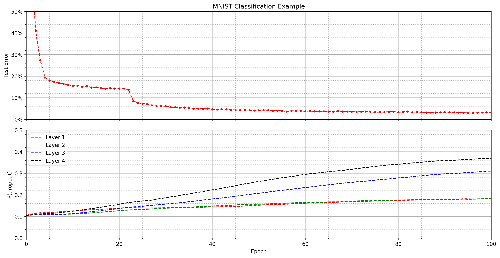

# ConcreteDropout

[](https://travis-ci.org/danielkelshaw/ConcreteDropout)

PyTorch implementation of **[Concrete Dropout](https://arxiv.org/pdf/1705.07832)**

This repository provides an implementation of the theory described in
the **[Concrete Dropout](https://arxiv.org/pdf/1705.07832)** paper. The
code provides a simple PyTorch interface which ensures that the module
can be integrated into existing code with ease.

- [x] Python 3.6+
- [x] MIT License

## **Overview:**
Obtaining reliable uncertainty estimates is a challenge which requires a
grid-search over various dropout probabilities - for larger models this 
can be computationally prohibitive.
The [Concrete Dropout](https://arxiv.org/pdf/1705.07832) paper suggests
a novel dropout variant which improves performance and yields better
uncertainty estimates.

Concrete Dropout uses the approach of optimising the dropout probability
through gradient descent in order to minimise an objective wrt. that 
parameter. Dropout can be viewed as as an approximating distribution to 
the posterior, `q(w)`. Using this interpretation it is possible to add a 
regularisation term to the loss function which is dependant on the KL 
Divergence, `KL[q(w)||p(w)]`; this ensures that the posterior does not 
deviate too far from the prior. As is often the case, the KL Divergence 
is computationally intractable and as such an approximation is developed - 
details of this can be seen in equations [2-4] in the [paper](https://arxiv.org/pdf/1705.07832).

In typical dropout the probability is modelled as a Bernoulli random
variable - unfortunately this does not play well with the re-parameterisation 
trick which is required to calculate the derivative of the objective. To 
allow the derivative to be calculated, a continous relaxation of the discrete
Bernoulli distribution is used - specifically the *Concrete* distribution
relaxation. This has a simple parameterisation which reduces to a simple
sigmoid distribution as seen in equation [5].

Through use of the *Concrete* relaxation it is now possible to compute
the derivatives of the objective with help from the re-parameterisation
trick and optimise the dropout probability through gradient descent.

## **Example:**
An example of `ConcreteDropout` has been implemented in 
`mnist_example.py` - this example can be run with:

```bash
python3 mnist_example.py
```



## **References:**

```
@misc{gal2017concrete,
    title={Concrete Dropout},
    author={Yarin Gal and Jiri Hron and Alex Kendall},
    year={2017},
    eprint={1705.07832},
    archivePrefix={arXiv},
    primaryClass={stat.ML}
}
```

##### **[Code](https://github.com/yaringal/ConcreteDropout)** by Yarin Gal, author of the paper.
###### PyTorch implementation of **[Concrete Dropout](https://arxiv.org/pdf/1705.07832)**<br>Made by Daniel Kelshaw
